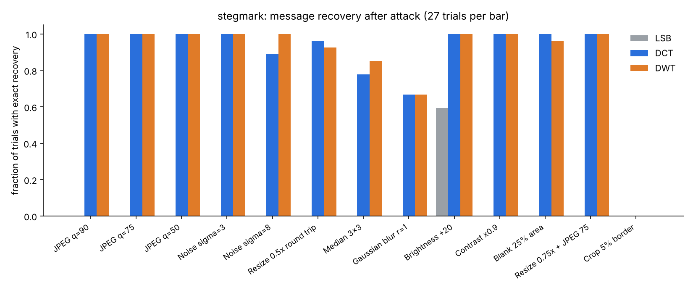
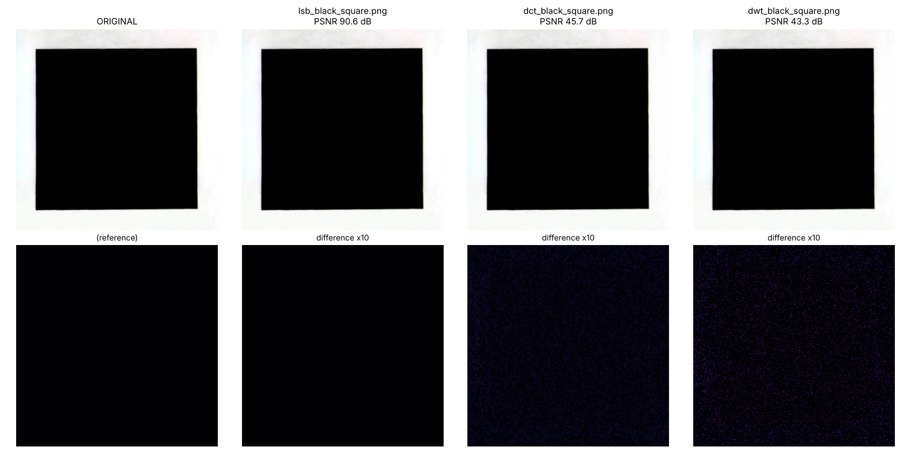

# stegmark: hide text in images with LSB, DCT and DWT

A working tool that hides a text message in any image (grayscale, RGB or RGBA, any size) and reads it back **from the image alone**. You don't need the message length, the filename or the method; the decoder detects them. DCT and DWT survive JPEG compression, noise and resizing. LSB is invisible but fragile. A password both keys the embedding positions and encrypts the message with AES-256-GCM (scrypt key derivation).



## Quick start
```
pip install -e .
stegmark hide photo.png marked.png -m "Karthikey Nori | owner 2026"          # DWT by default
stegmark hide photo.png marked.png -m "secret" --method DCT -p mypassword
stegmark reveal marked.png [-p mypassword]                                    # method auto-detected
stegmark compare photo.png marked.png --figure cmp.png                        # MSE / PSNR / SSIM
stegmark test photo.png -m "test"                                             # attack suite, all methods
stegmark capacity photo.png
stegmark                                                                      # interactive menu (encode / decode / compare / test)
```
```python
from stegmark import hide, reveal, load_image, save_image
stego, info = hide(load_image("photo.png"), "hello", method="DCT")
save_image(stego, "marked.png")
print(reveal(load_image("marked.png")).text)
```

## How it works
- **Self-describing header**: magic, method, flags, Reed-Solomon parity count and payload length (8 bytes + 8 RS parity bytes), repeated across the image. The decoder reads the header first, then knows the payload layout.
- **Payload**: UTF-8 text, optionally AES-GCM encrypted, then Reed-Solomon (the encoder uses the most parity, up to 32 bytes, that still leaves at least 3 copies of each bit), then repeated to fill the available slots. Copies are combined by soft majority vote.
- **LSB**: least significant bit of keyed R, G, B values (alpha untouched).
- **DCT**: dithered QIM on coefficient (1,2) of every 8x8 luma block (step 32).
- **DWT**: dithered QIM on the level-2 Haar horizontal-detail coefficient of keyed 4x4 luma blocks, one block in four (step 40). Tests check the coefficient against `pywt.wavedec2`.
- DCT/DWT change luma only (the same offset goes on R, G and B), so colours are not tinted. Embedding is iterated so that 8-bit rounding and clipping in pure black/white areas do not corrupt bits. `hide` re-reads the saved file to verify it.

## Results (end-to-end tool, `benchmarks/evaluate_tool.py`)
9 images at native size (8 scikit-image samples, from 371x370 to 1411x1411, including an RGBA logo, plus the black-square image from the course project). The step sizes were tuned on astronaut and camera in the earlier study, and those two are excluded here. 3 keys per image = 27 trials per cell. 27-byte message, PNG save/reload, blind decoding. Full tables: [`results/tool/results.md`](results/tool/results.md).

| Attack | LSB | DCT | DWT |
|---|---|---|---|
| none | 27/27 | 27/27 | 27/27 |
| JPEG q=90 / 75 / 50 | 0/27 | 27/27 | 27/27 |
| Noise sigma=3 | 0/27 | 27/27 | 27/27 |
| Noise sigma=8 | 0/27 | 24/27 | 27/27 |
| Resize 0.5x round trip | 0/27 | 26/27 | 25/27 |
| Median 3x3 | 0/27 | 21/27 | 23/27 |
| Gaussian blur r=1 | 0/27 | 18/27 | 18/27 |
| Brightness +20 | 16/27* | 27/27 | 27/27 |
| Contrast x0.9 | 0/27 | 27/27 | 27/27 |
| Blank 25% area | 0/27 | 27/27 | 26/27 |
| Resize 0.75x + JPEG 75 | 0/27 | 27/27 | 27/27 |
| Crop 5% border | 0/27 | 0/27 | 0/27 |

*LSB partly "survives" +20 only because 20 is even, so LSB parity is preserved where nothing clips. That is not real robustness.

| Method | PSNR dB mean (min) | SSIM mean (min) |
|---|---|---|
| LSB | 85.7 (81.1) | 1.0000 (1.0000) |
| DCT | 46.8 (45.7) | 0.9808 (0.9386) |
| DWT | 44.8 (43.3) | 0.9729 (0.9202) |

False positives: 0/9 unmarked images reported a watermark. Failures cluster on the smallest images, which hold the fewest copies of each bit.

**Dither ablation** (same benchmark, undithered QIM): Blank 25% went from 15→27 (DCT) and 16→26 (DWT), brightness from 21→27 and 24→27, median from 17→21 and 19→23, and mean PSNR rose by about 0.6 dB. The only regression was DWT under 0.5x resize (27→25).

The course project's black-square image, all three methods, no tint:


## Limitations
- **No geometric robustness**: cropping, rotation, or rescaling to a different size breaks decoding (5% crop: 0/27). Real social networks usually resize, so the "Resize 0.75x + JPEG 75" row (same final size) is not a real-platform test.
- Blur and median filtering are partial (18-23/27).
- Capacity for DCT/DWT is about 1 byte per 600-700 pixels (e.g. 110 bytes at 600x400, 1170 bytes at 1411x1411). Run `stegmark capacity`.
- 9 images x 3 keys is a small benchmark, and no steganalysis (detectability) was tested.

### Earlier controlled study (grayscale, fixed payload, `src/`)
The design (which DCT coefficient, step size) was tuned on two other images, and every number below comes from four images the tuning never saw. Full tables are in [`results/results.md`](results/results.md) and the raw data in `results/results.csv`.

| Method | PSNR (dB) | SSIM | JPEG q=50 | Noise s=5 | Resize 0.5x | Median 3x3 | Blank 25% |
|---|---|---|---|---|---|---|---|
| LSB | 69.1 | 0.9999 | 0/4 | 0/4 | 0/4 | 0/4 | 0/4 |
| DCT (step 32) | 46.8 | 0.9866 | 4/4 | 4/4 | 4/4 | 1/4 | 0/4 |
| DWT (step 40) | 44.9 | 0.9801 | 4/4 | 4/4 | 4/4 | 3/4 | 0/4 |

*Cells show images where the exact message was recovered, with Reed-Solomon on.*

**Findings**
- LSB is nearly invisible but is destroyed by any re-compression or noise (BER about 0.4 to 0.5, which is chance).
- DCT and DWT survive JPEG down to q=50, noise and resizing with 0 bit errors before error correction. DWT is more robust to the median filter, at slightly lower PSNR.
- Imperceptibility and robustness trade off through the QIM step size (see `results/tradeoff.png`).
- Reed-Solomon mattered for resizing and median filtering, where it turned a partly corrupted payload into an exact recovery.
- My first DCT design used a higher-frequency coefficient (3,4) and failed under JPEG q<=70, because JPEG's quantiser removes it. Moving to (1,2) fixed that. This is why the tuning/held-out split exists.

**Limitations**
- Only 4 held-out images, so recovery fractions move in steps of 0.25. Treat the numbers as indicative, not statistically strong.
- No geometric attacks (rotation, cropping and rescaling with resynchronisation) and no steganalysis tests.
- Blanking 25% of the image defeats all three methods; handling it needs more redundancy or a synchronisation scheme.
- Grayscale images only, fixed 32-byte payload.

## Fixed from the course version
The original driver (`watermarking.py`) had several bugs:
- Its "DCT" never applied the inverse DCT, which caused the blue/yellow tint.
- It had no DWT.
- Its "LSB" overwrote whole blue bytes.
- Its compare step called undefined functions.
- Decoding depended on in-memory filenames.

All of these are replaced by this tool.

## Run it
```
pip install -r requirements.txt && pip install -e .
python -m pytest -q tests              # 56 tests
python benchmarks/evaluate_tool.py     # regenerates results/tool/ (~2 min)
python src/run_experiments.py          # regenerates the earlier grayscale study in results/
```

## Layout
```
stegmark/            the tool: core.py (embedding), api.py (text, crypto, I/O, metrics), attacks.py, cli.py
benchmarks/          end-to-end evaluation
src/                 earlier controlled grayscale study
tests/               pytest suite
examples/            black-square cover and LSB/DCT/DWT stego images
results/tool/        end-to-end results;  results/  earlier study
```

*Development note: written with assistance from Claude (Anthropic); I ran, tested and can explain all of the code.*
